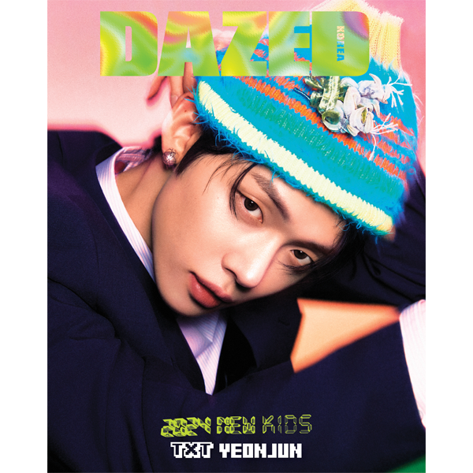
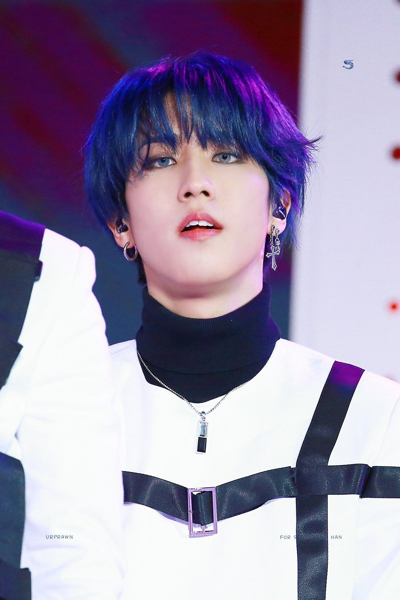

# 517-miller-kpop

This is a sample repository used to get used to the Github workflow.

## My Favorite K-Pop Idols

Below, I've provided a very brief (and somewhat comedic) introduction to a few of my favorite K-Pop idols. Though I'm out of my K-Pop phase as of late, the subject matter made this exercise very fun. I hope you enjoy.

In the order of men: 
1. Beautiful K-Pop Boys
2. Everyone else
3. Elon Musk (very bottom of list)

### Yeonjun - Tomorrow x Together

[Enjoy Yeonjun's performance with group member Soobin.](https://youtu.be/J3QkdvK4ySg?si=UGIbCMvtGvymwaSi)

#### Skills

- VERY Handsome | 10/10 Visuals
- Fashion Icon | Is the Moment
- Rap
- Dance
- Vocals

### Han - Stray Kids

[Watch one of Han's iconic moments!](https://youtu.be/Pjst6eJKmJ4?si=zSHoK2WvpbZIPy7l)

#### Skills 

- All-Rounder!!
- Visuals
- Rap
- Dance
- Vocal
- 3racha

### Yoongi - BTS 

[Check out Yoogni's collab with K-Pop legend PSY](https://youtu.be/8dJyRm2jJ-U?si=xi-SInDOs4Cw3Uh6)

#### Skills

- Yoongi Marry Me
- Rap
- Music Production